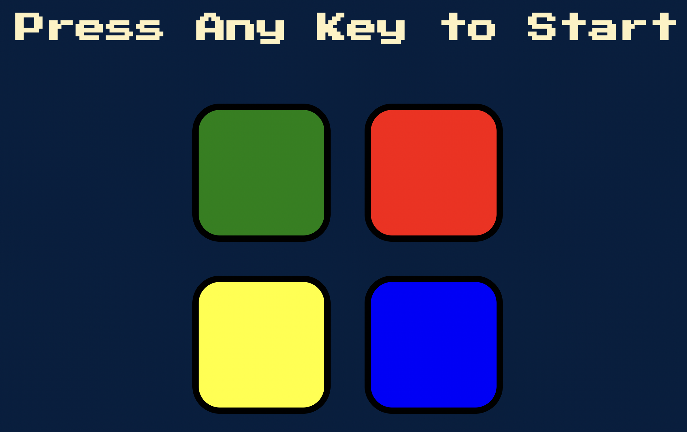

# Simon-Game
 
Small front-end web development Simon Game project from Udemy course (2022 Web Development Bootcamp by Dr. Angela Yu).

Created a client side web application Simon Game through applying HTML, CSS, and JavaScript/jQuery knowledge. 

**Sample HomePage**

 

